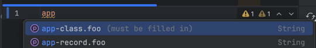

I've autocomplete on intellij, but only on the class i've got the javadoc 'carried over', see:




the spring-configuration-metadata.json file seems fine:

```json
{
  "groups": [
    {
      "name": "app-class",
      "type": "com.example.demo.ApplicationPropertiesClass",
      "sourceType": "com.example.demo.ApplicationPropertiesClass"
    },
    {
      "name": "app-record",
      "type": "com.example.demo.ApplicationPropertiesRecord",
      "sourceType": "com.example.demo.ApplicationPropertiesRecord"
    }
  ],
  "properties": [
    {
      "name": "app-class.foo",
      "type": "java.lang.String",
      "description": "must be filled in.",
      "sourceType": "com.example.demo.ApplicationPropertiesClass"
    },
    {
      "name": "app-record.foo",
      "type": "java.lang.String",
      "description": "Must be filled in.",
      "sourceType": "com.example.demo.ApplicationPropertiesRecord"
    }
  ],
  "hints": []
}
```
reproduced on macbook intellij idea ultimate  2024.3.1.1 